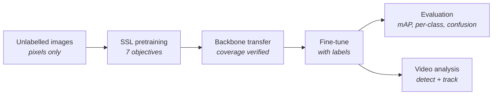

<div align="center">

# SSL Detection Lab

**Pretrain YOLO backbones without labels. Transfer them into detectors. Measure whether it helped.**

[](https://www.python.org/)
[](https://pytorch.org/)
[](https://docs.ultralytics.com/)
[](LICENSE)
[](pyproject.toml)

SimCLR · BYOL · MoCo · DINOv2 · DINOv3 · MAE · I-JEPA

</div>

---

> ### 🎓 New here? Start with the labs.
>
> You do **not** need a GPU or a local install. Every lab runs in your browser on a free Kaggle
> T4 x2 runtime.
>
> **1.** Open [Lab 1: SimCLR pretraining](https://www.kaggle.com/code/rifat963/cse445-simclr-football-t4x2-tutorial) →
> **2.** Click **Copy & Edit** →
> **3.** Set **Accelerator → GPU T4 x2**, turn **Internet on**, and run all cells.
>
> Then follow the [recommended learning path](#recommended-learning-path).

---

## Contents

**Getting started**
- [What this package does](#what-this-package-does)
- [Quick start](#quick-start)
- [Documentation](#documentation)

**For students**
- [Kaggle labs](#kaggle-labs)
- [How to run a lab on Kaggle](#how-to-run-a-lab-on-kaggle)
- [Recommended learning path](#recommended-learning-path)
- [What each lab teaches](#what-each-lab-teaches)

**Reference**
- [SSL architectures](#ssl-architectures)
- [Model families](#model-families)
- [Model naming](#model-naming-no-v-from-yolo11-onward)

**Guides**
- [1 · Pretrain without labels](#1--pretrain-without-labels)
- [2 · Transfer into a detector](#2--transfer-into-a-detector)
- [3 · Evaluate on labelled data](#3--evaluate-on-labelled-data)
- [4 · Analyse a video](#4--analyse-a-video)
- [Trackers](#trackers)
- [Reusable components](#reusable-components)
- [DINOv2 and DINOv3 feature backbones](#dinov2-and-dinov3-feature-backbones)

**Doing it properly**
- [Compute-scaled adaptations](#compute-scaled-adaptations)
- [Suggested experimental protocol](#suggested-experimental-protocol)
- [Runtime baseline](#runtime-baseline)
- [Development](#development)
- [License and citation](#license-and-citation)

---

## What this package does

Self-supervised learning lets you use **unlabelled** images — which you usually have a lot of —
to give a detector a better starting point than random weights. This package covers the whole
loop, end to end:



Designed for CSE445 Computer Vision labs and Kaggle runtimes. Training loops live in normal
Python modules; notebooks hold configuration, plots, and interpretation — so the code stays
testable and the notebooks stay readable.

**Three things this package is careful about:**

| | |
|---|---|
| 🔍 **No hidden label use** | Pretraining reads image pixels only. Annotation files are never opened. `run_manifest.json` records whether you started from random weights or a COCO warm start. |
| 📏 **Honest metric boundaries** | Video analysis reports what is measurable without ground truth and names what is not. SSL loss is never presented as detection accuracy. |
| 🧾 **Documented adaptations** | MAE, DINOv2, and I-JEPA are compute-scaled adaptations to a CNN backbone, not reproductions. See [Compute-scaled adaptations](#compute-scaled-adaptations). |

---

## Quick start

### Install

```bash
pip install "git+https://github.com/rifat963/ssl-detection-lab.git@main"
```

<details>
<summary>Editable install, optional extras, and managed platforms</summary>

```bash
git clone https://github.com/rifat963/ssl-detection-lab.git
cd ssl-detection-lab
pip install -e ".[dev]"
```

| Extra | Installs |
|---|---|
| `[dev]` | pytest, ruff |
| `[dinov3]` | PyTorch 2.7.1+ floor for DINOv3 backbones |
| `[dinov3-yolo]` | LightlyTrain for DINOv3 → YOLO26 distillation |

**On Kaggle, Colab, or SageMaker:** keep the platform's CUDA-matched PyTorch build and upgrade
only this package plus Ultralytics. Installing a generic PyTorch wheel commonly replaces a CUDA
build with a CPU-only one and silently drops you to CPU training.

Full details: [wiki/Installation](wiki/Installation.md)

</details>

### Verify the environment

```bash
ssldet doctor     # Python, package floors, CUDA, cuDNN, every visible GPU
ssldet models     # supported SSL objectives, model families, and trackers
ssldet trackers   # supported multi-object trackers
```

`ssldet doctor` never crashes — a broken CUDA driver is reported as a field, not an exception, so
it still works when things are broken.

### Pretrain in 60 seconds

```python
from ssldet import PretrainConfig, pretrain

result = pretrain(PretrainConfig(
    method="simclr",
    image_roots=["/data/unlabelled/images"],
    output_dir="runs/simclr",
    yolo_model="yolo26n.yaml",     # .yaml = random init · .pt = COCO warm start
    epochs=25,
    batch_size=32,                 # per GPU
).validate())

print(result.yolo_checkpoint)
```

Always call `.validate()` — it catches contradictory settings before any GPU time is spent.

> **Check the plumbing first.** `make_dry_run_config(...)` builds a deliberately tiny one-epoch
> configuration that verifies data loading, augmentation, checkpointing, and transfer in
> minutes. It proves nothing about model quality — that is the point.

---

## Documentation

Task-oriented guides live in the [`wiki/`](wiki/) folder.

| Page | Use it when |
|---|---|
| [Installation](wiki/Installation.md) | Setting up locally, on a cluster, or on a managed platform |
| [Quickstart](wiki/Quickstart.md) | Running your first pretraining job end to end |
| [SSL Methods](wiki/SSL-Methods.md) | Choosing an objective and understanding what it optimizes |
| [Model Families](wiki/Model-Families.md) | Checking whether your model is supported |
| [Configuration](wiki/Configuration.md) | Every `PretrainConfig` field and its validation rule |
| [Downstream Transfer](wiki/Downstream-Transfer.md) | Moving an SSL checkpoint into a detector |
| [Evaluation](wiki/Evaluation.md) | Scoring a detector on labelled data |
| [Video Analysis](wiki/Video-Analysis.md) | Running detection and tracking on video |
| [Troubleshooting](wiki/Troubleshooting.md) | Something broke — organized by error message |
| [Contributing](wiki/Contributing.md) | Adding a method, sending a patch |

---

## Kaggle labs

Every lab is published as a **public Kaggle notebook** and mirrored in this repository under
[`output/yolo26-notebooks/`](output/yolo26-notebooks/).

### How to run a lab on Kaggle

1. Open the Kaggle link and click **Copy & Edit** (sign-in required).
2. Right sidebar → **Session options → Accelerator → GPU T4 x2**.
3. Turn **Internet on** (needed to install this package and download YOLO weights).
4. **Add Input** → attach `iasadpanwhar/football-player-detection-yolov8` if not already present.
5. Run all cells top to bottom. Each notebook installs `ssl-detection-lab` for you.

> **Run pretraining before its downstream partner.** Downstream labs consume the `best_ssl.pt`
> checkpoint produced by the matching SSL lab — or attach a previously saved checkpoint as a
> Kaggle input.

### Recommended learning path

Labs 1–2, 3–4, 5–6, and 7–8 are **pretrain → downstream pairs**. Lab 9 stands alone.

| # | Lab | Run on Kaggle | Local copy |
|---:|---|---|---|
| 1 | **SimCLR pretraining** — contrastive basics, t-SNE, nearest neighbours | [Open](https://www.kaggle.com/code/rifat963/cse445-simclr-football-t4x2-tutorial) | [notebook](output/yolo26-notebooks/simclr_football_t4x2_tutorial.ipynb) |
| 2 | **SimCLR → YOLO26 downstream** — transfer, fine-tune, evaluate, track | [Open](https://www.kaggle.com/code/rifat963/cse445-simclr-yolo26-football-downstream-tutorial) | [notebook](output/yolo26-notebooks/simclr_yolo26_football_downstream_tutorial.ipynb) |
| 3 | **BYOL pretraining** — online/EMA branches, AMP, distributed T4 x2 | [Open](https://www.kaggle.com/code/rifat963/cse-445-byol-football-t4x2-tutorial) | [notebook](output/yolo26-notebooks/byol_football_t4x2_tutorial.ipynb) |
| 4 | **BYOL → YOLO26 downstream** — transfer, fine-tune, BoT-SORT tracking | [Open](https://www.kaggle.com/code/rifat963/cse445-byol-yolo26-football-downstream-tutorial) | [notebook](output/yolo26-notebooks/byol_yolo26_football_downstream_tutorial.ipynb) |
| 5 | **I-JEPA pretraining** — masked latent-block prediction | [Open](https://www.kaggle.com/code/rifat963/cse445-ijepa-yolo26-football-ssl-tutorial) | [notebook](output/yolo26-notebooks/ijepa_yolo26_football_ssl_tutorial.ipynb) |
| 6 | **I-JEPA → YOLO26 downstream** | [Open](https://www.kaggle.com/code/rifat963/cse-445-ijepa-yolo26-downstream-tutorial) | [notebook](output/yolo26-notebooks/ijepa_yolo26_downstream_tutorial.ipynb) |
| 7 | **DINOv3-guided distillation** — frozen-teacher feature distillation | [Open](https://www.kaggle.com/code/rifat963/cse-445-dinov3-yolo26-football-ssl-tutorial) | [notebook](output/yolo26-notebooks/dinov3_yolo26_football_ssl_tutorial.ipynb) |
| 8 | **DINOv3 → YOLO26 downstream** | [Open](https://www.kaggle.com/code/rifat963/cse445-dinov3-yolo26-downstream-tutorial) | [notebook](output/yolo26-notebooks/dinov3_yolo26_downstream_tutorial.ipynb) |
| 9 | **Data association and multi-object tracking** | [Open](https://www.kaggle.com/code/rifat963/cse445-data-association-ultralytics-trackers) | [notebook](output/tracker/tracker_data_association_tutorial.ipynb) |

### The YOLO12 notebook set

[`output/yolo12-notebooks/`](output/yolo12-notebooks/) mirrors the series against a **YOLO12**
backbone, with one self-contained pretrain → transfer notebook per objective:

[SimCLR](output/yolo12-notebooks/simclr_yolo12_football_ssl_tutorial.ipynb) ·
[BYOL](output/yolo12-notebooks/byol_yolo12_football_ssl_tutorial.ipynb) ·
[MoCo](output/yolo12-notebooks/moco_yolo12_football_ssl_tutorial.ipynb) ·
[DINOv2](output/yolo12-notebooks/dinov2_yolo12_football_ssl_tutorial.ipynb) ·
[DINOv3](output/yolo12-notebooks/dinov3_yolo12_football_ssl_tutorial.ipynb) ·
[MAE](output/yolo12-notebooks/mae_yolo12_football_ssl_tutorial.ipynb) ·
[I-JEPA](output/yolo12-notebooks/ijepa_yolo12_football_ssl_tutorial.ipynb)

### The tracker lab

[`output/tracker/`](output/tracker/) holds the standalone
[data-association lab](output/tracker/tracker_data_association_tutorial.ipynb): it runs **all six
trackers** over identical frames with identical detections, so every difference is attributable
to the association algorithm alone, then analyses track lifetimes and tuning. It needs
`ssl-detection-lab` 0.9.0+ and a fine-tuned detector; no SSL checkpoint required.

### The all-in-one lab notebook

[`ssl_detection_lab_football_t4x2_tutorial.ipynb`](output/yolo26-notebooks/ssl_detection_lab_football_t4x2_tutorial.ipynb)
audits the YOLO labels, dry-runs every self-contained SSL method, probes each supported model
family, fine-tunes one detector, exports labelled evaluation metrics, and exercises video
analysis. It installs the library from an attached source folder when available, otherwise from
GitHub. It contains no embedded wheel or Base64 package data.

### What each lab teaches

<details>
<summary>Expand lab-by-lab detail</summary>

- **SimCLR pretraining** trains a YOLO backbone using image pixels only, plots training history,
  extracts validation features, creates a labelled t-SNE visualization, and inspects
  cosine-nearest neighbours in the learned feature space.
- **BYOL pretraining** explains the online and EMA target branches, demonstrates the reusable
  BYOL factory, trains with AMP and distributed T4 x2 execution, checks for feature variation,
  and visualizes the representation with t-SNE and nearest neighbours.
- **SimCLR downstream** transfers a `best_ssl.pt` online encoder into YOLO26, verifies
  backbone-key coverage, warms up the randomly initialized detection head, fine-tunes the full
  detector, exports labelled test metrics, and runs tracking and video analysis. The BYOL,
  I-JEPA, and DINOv3 downstream labs follow the same structure.
- **The DINOv3 SSL lab** performs label-free frozen-teacher feature distillation into YOLO26. It
  does not claim to reproduce the official DINOv3 pretraining recipe.
- **The tracker lab** covers the Ultralytics tracker configurations and the data-association step
  that links detections into tracks across frames. See [Trackers](#trackers) for all six.

</details>

---

## SSL architectures

```bash
ssldet models            # human-readable
ssldet models --json     # machine-readable, for UIs and notebooks
```

| Architecture | Type | Objective | Views | Moving target | Pick it when |
|---|---|---|---:|---|---|
| **SimCLR** | Contrastive | NT-Xent cross-view agreement | 2 | No | Large per-GPU batch; simple baseline |
| **BYOL** | Non-contrastive | Online-to-target latent prediction | 2 | EMA | Small batch; no negatives needed |
| **MoCo** | Contrastive | Positive key + negative queue | 2 | EMA | Small batch, many negatives wanted |
| **DINOv2** | Self-distillation | Multi-crop teacher/student + KoLeo | 2+ | EMA | Local-to-global reasoning |
| **DINOv3** | Foundation distillation | Frozen global + dense feature regression | 1 | Frozen | You have official DINOv3 weights |
| **MAE** | Generative | Masked pixel reconstruction | 1 | No | Cheapest per step |
| **I-JEPA** | Predictive | Masked latent-block prediction | 1 | EMA | Semantic targets without pixels |

**Compute rule of thumb.** Single-view methods (`mae`, `ijepa`, `dinov3`) cost one encoder pass
per image; two-view methods cost two; `dinov2` costs `2 + local_crops` student passes.

Each objective's mechanics, parameters, and constraints: [wiki/SSL-Methods](wiki/SSL-Methods.md).

### Switching methods

Only the method-specific fields change:

<details>
<summary>YAML snippets for all seven objectives</summary>

```yaml
# SimCLR
method: simclr
temperature: 0.20
projection_dim: 128

# BYOL
method: byol
momentum: 0.996
final_momentum: 1.0

# MoCo
method: moco
temperature: 0.20
queue_size: 16384

# DINOv2-style
method: dinov2
local_crops: 4
local_crop_size: 96
dino_output_dim: 4096
student_temperature: 0.10
teacher_temperature: 0.04
center_momentum: 0.90
koleo_weight: 0.10

# DINOv3-guided (requires user-supplied official weights)
method: dinov3
dinov3_model: dinov3_vits16
dinov3_weights: /path/to/dinov3_vits16.pth
dinov3_global_weight: 1.0
dinov3_dense_weight: 1.0

# MAE
method: mae
mask_ratio: 0.60

# I-JEPA
method: ijepa
num_target_blocks: 4
target_scale_min: 0.10
target_scale_max: 0.25
predictor_depth: 2
```

Every field and its validation rule: [wiki/Configuration](wiki/Configuration.md).

</details>

---

## Model families

| Family | Common scales | SSL pretraining | Labelled evaluation | Video analysis |
|---|---|:---:|:---:|:---:|
| YOLO26 | n, s, m, l, x (+ P2/P6 YAML) | ✅ | ✅ | ✅ |
| YOLO12 | n, s, m, l, x | ✅ | ✅ | ✅ |
| YOLO11 | n, s, m, l, x | ✅ | ✅ | ✅ |
| YOLOv10 | n, s, m, b, l, x | ✅ | ✅ | ✅ |
| YOLOv9 | t, s, m, c, e | ✅ | ✅ | ✅ |
| YOLOv8 | n, s, m, l, x | ✅ | ✅ | ✅ |
| YOLOv6 | n, s, m, l, x | ✅ | ✅ | ✅ |
| YOLOv5u | n, s, m, l, x | ✅ | ✅ | ✅ |
| YOLOv3u | standard, SPP, tiny | ✅ | ✅ | ✅ |
| Custom Ultralytics YOLO | custom | ⚙️ runtime checked | ✅ | ✅ |
| RT-DETR | l, x | ❌ | ✅ | ✅ |
| YOLO-NAS | s, m, l | ❌ | ✅ | ✅ |

SSL pretraining requires an Ultralytics YAML-defined backbone ending in a spatial
`B x C x H x W` feature map; custom models are checked when the backbone adapter is created.
RT-DETR and YOLO-NAS expose no such tensor, so they are evaluation- and video-only. Evaluation
support is intentionally wider than SSL support. YOLOv5 means current Ultralytics-compatible
**YOLOv5u** weights, not legacy YOLOv5 repository checkpoints.

### Model naming: no `v` from YOLO11 onward

Ultralytics dropped the `v` starting with YOLO11:

```python
YOLO("yolo12n.yaml")    # ✅ correct
YOLO("yolov12n.yaml")   # ❌ FileNotFoundError — this file does not exist upstream
```

A weights file named `yolov12n.pt` still loads, but reports label it *Custom Ultralytics YOLO*
instead of *YOLO12*. Older families genuinely branded with a `v` (`yolov8`, `yolov10`, …) resolve
under both spellings. Details: [wiki/Model-Families](wiki/Model-Families.md#naming-no-v-from-yolo11-onward).

### `.yaml` vs `.pt` — what your experiment claims

| Suffix | Initialization | The claim you can make |
|---|---|---|
| `yolo26n.yaml` | Random | Strict label-free SSL pretraining |
| `yolo26n.pt` | COCO-supervised | Warm start **plus** label-free domain adaptation |

`run_manifest.json` records which you used in its `initialization` field. Never report the second
setting as training without labels.

---

## 1 · Pretrain without labels

### Single GPU

```python
from ssldet import PretrainConfig, pretrain

config = PretrainConfig(
    method="ijepa",
    image_roots=["/kaggle/input/my-dataset/train/images"],
    output_dir="/kaggle/working/ijepa_yolo26/ssl",
    yolo_model="yolo26n.yaml",
    epochs=25,
    batch_size=16,
    image_size=224,
    grad_accum_steps=2,
).validate()

result = pretrain(config)
print(result.yolo_checkpoint)
```

### Two GPUs

```python
from ssldet import launch_distributed_pretrain, make_dry_run_config

config = make_dry_run_config(
    method="dinov2",
    train_images="/kaggle/input/.../train/images",
    output_dir="/kaggle/working/runs/dinov2_yolo11n",
    yolo_model="yolo11n.yaml",
)
result = launch_distributed_pretrain(config, num_processes=2)
print(result.succeeded, result.output_dir)
```

Equivalent from the shell, using a config in `examples/`:

```bash
torchrun --standalone --nproc_per_node=2 \
  -m ssldet.cli --config /kaggle/working/ijepa_t4x2.yaml
```

### Settings that matter

> **`batch_size` is per GPU.** The effective optimizer batch is
> `world_size × batch_size × grad_accum_steps`.
>
> **Gradient accumulation does not create extra contrastive negatives** for SimCLR or MoCo. It
> raises the optimizer batch only. For more negatives, raise `batch_size` or MoCo's `queue_size`.

- `image_size: 224`, `batch_size: 16`, `grad_accum_steps: 2` are safe starting points for two
  16 GB T4 GPUs with YOLO26n.
- `amp: true` enables FP16 mixed precision (CUDA only).
- Pretrain on `train/images` only — including validation or test images creates transductive
  leakage in a standard evaluation.

### Outputs

```text
best_ssl.pt                 # complete SSL state for analysis/resume
last_ssl.pt                 # latest complete SSL state
history.csv                 # epoch loss, learning rate, time, EMA momentum
run_manifest.json           # reproducibility and initialization record
ijepa_pretrained_yolo26n.pt # detector carrying the learned online backbone
```

---

## 2 · Transfer into a detector

```python
from ssldet import transfer_ssl_backbone_to_yolo

transfer = transfer_ssl_backbone_to_yolo(
    "runs/ijepa/best_ssl.pt",
    "runs/ijepa/backbone.pt",
    yolo_model="yolo26n.yaml",     # optional — the checkpoint records it
)
print(f"{transfer.coverage:.1%} coverage")   # expect 100%
```

Only the trainable online/student encoder moves across. The projection head, predictor, target
network, optimizer, scheduler, and gradient scaler are all discarded, and the excluded list is
written into a sibling `*.transfer.json` provenance report.

**Coverage below 100% means a mismatch** — transfer into the same family *and* scale you
pretrained on. The call raises rather than silently producing a half-initialized detector.

Then fine-tune with ordinary Ultralytics code:

```python
from ultralytics import YOLO

detector = YOLO("runs/ijepa/backbone.pt")
detector.train(data="football_detection.yaml", epochs=60, imgsz=960, batch=12, device=[0, 1])
```

More: [wiki/Downstream-Transfer](wiki/Downstream-Transfer.md).

---

## 3 · Evaluate on labelled data

```bash
ssldet evaluate \
  --model yolo26n \
  --weights /path/to/best.pt \
  --data /path/to/dataset.yaml \
  --split test \
  --output runs/football-evaluation
```

```python
from ssldet import EvaluationConfig, evaluate

report = evaluate(EvaluationConfig(
    model_name="yolo26n",
    weights_file="/path/to/best.pt",
    data="/path/to/dataset.yaml",
    output_dir="runs/football-evaluation",
    split="test",
).validate())
print(report.metrics_json)
```

Retains every metric the installed Ultralytics validator exposes: precision, recall, F1,
TP/FP/FN, mAP50, mAP75, mAP50-95, per-class AP, per-image metrics, fitness, curves, confusion
matrix, and preprocess/inference/postprocess timings. Box, segmentation, pose, and OBB metrics
are captured when the model exposes them.

| Output | Contents |
|---|---|
| `metrics.json` | Everything, schema-versioned; non-finite floats become `null` |
| `summary.csv` | Headline table |
| `per_class_metrics.csv` | Precision, recall, F1, AP50, AP50-95 per class |
| `per_image_metrics.csv` | Per-image precision/recall/F1/TP/FP/FN |
| `confusion_matrix.csv` | Labelled matrix; rows = predictions, columns = ground truth |

More: [wiki/Evaluation](wiki/Evaluation.md).

---

## 4 · Analyse a video

```bash
ssldet video \
  --source "https://youtu.be/LNwODJXcvt4" \
  --model yolo26n \
  --weights /path/to/best.pt \
  --output runs/football-video
```

The source may be a local file, direct HTTP URL, RTSP stream, webcam index, or any video-service
URL the installed Ultralytics supports. Use `--tracker none` for detection only, `--stride 2` to
sample every second frame, or `--max-frames 500` for a bounded run.

### Trackers

All six Ultralytics trackers are supported and catalogued:

```bash
ssldet trackers          # human-readable
ssldet trackers --json   # machine-readable
```

| Tracker | Association | ReID | Motion comp. | Pick it when |
|---|---|:---:|:---:|---|
| **botsort** *(default)* | IoU + optional ReID + GMC | ✅ | ✅ | Moving camera or frequent occlusion |
| **bytetrack** | IoU over high/low-confidence detections | ❌ | ❌ | Fastest; static camera, clear separation |
| **ocsort** | Observation-centric IoU + velocity | ❌ | ❌ | Nonlinear motion, no ReID budget |
| **deepocsort** | Observation-centric IoU + appearance | ✅ | ✅ | Crowding where ID switches dominate |
| **fasttrack** | ByteTrack-style IoU + occlusion rollback | ❌ | ❌ | Heavy mutual occlusion, ByteTrack cost |
| **tracktrack** | Multi-cue HMIoU + confidence + angle | ✅ | ✅ | Best association when compute allows |

An unknown tracker name is rejected by `.validate()` before any weights load, and
`video_analysis.json` records the **resolved** tracker settings — not just the filename — so a
tracked run stays reproducible across Ultralytics versions.

> Trackers consume detector output and are **not** trained by this package. SSL pretraining
> improves tracking only insofar as it improves detections. Tracker configs ship with Ultralytics
> under AGPL-3.0 and are resolved from your install rather than vendored here.

Details, ReID notes, and how to customize a config: [wiki/Video-Analysis](wiki/Video-Analysis.md#supported-trackers).

```python
from ssldet import VideoAnalysisConfig, analyze_video

outcome = analyze_video(VideoAnalysisConfig(
    video_source="https://example.com/match.mp4",
    model_name="yolo26n",
    weights_file="/path/to/best.pt",
    output_dir="runs/football-video",
    tracker="botsort.yaml",
).validate())
print(outcome.outcome_markdown, outcome.report_json)
```

```text
outcome.md          # readable headline and per-class outcome
video_analysis.json # full aggregate report
frames.csv          # counts, confidence, and latency for every frame
detections.csv      # class, confidence, track ID, box, location, occupancy
<annotated video>   # detections and track IDs rendered by Ultralytics
```

> ### A plain video has no ground truth
>
> **Measurable here:** frame coverage · class distribution · confidence distribution
> (min/max/mean/median/std/p5/p95/p99) · detections per frame · normalized box occupancy ·
> unique tracks · sampled track length · per-stage latency · model pipeline FPS · end-to-end
> processing FPS.
>
> **Not calculable from a video link:** precision · recall · F1 · AP/mAP · confusion-matrix
> accuracy · MOTA · MOTP · IDF1 · HOTA. Label the frames and use
> [the evaluator](#3--evaluate-on-labelled-data). Tracking accuracy additionally needs
> ground-truth object identities.

The weights passed here must be a **fine-tuned detector checkpoint** such as `best.pt`.
`best_ssl.pt` holds training state and is not itself a detector.

More: [wiki/Video-Analysis](wiki/Video-Analysis.md).

---

## Reusable components

```text
ssldet.ssl          reusable objectives, losses, interfaces, custom-module registry
ssldet.backbones    YOLO, DINOv2, and DINOv3 feature encoders
ssldet.detection    backend-neutral detector protocol and Ultralytics adapter
ssldet.evaluation   labelled object-detection evaluation and metric export
ssldet.video        streaming detection/tracking and video metrics
ssldet.downstream   verified SSL-checkpoint transfer into YOLO detectors
ssldet.workflow     dry-run and distributed-launch helpers
```

### Any objective, any encoder

```python
from ssldet.ssl import available_ssl_modules, create_ssl_module

print(available_ssl_modules())
# ('byol', 'dinov2', 'dinov3', 'ijepa', 'mae', 'moco', 'simclr')

simclr = create_ssl_module(
    "simclr", encoder=my_encoder,
    feature_dim=768, hidden_dim=1024, projection_dim=256, temperature=0.2,
)
loss = simclr((first_view, second_view))
```

Pooled objectives need an encoder returning `B x C`; MAE, I-JEPA, and DINOv3 additionally need
`forward_feature_map()` returning `B x C x H x W`.

Custom objectives subclass `SSLMethod` and register with `register_ssl_module()`. Set
`requires_two_views = True` on the class when the objective consumes more than one view — the
trainer reads it through `ssl_module_requires_two_views()` to decide whether a dataset is large
enough. See [wiki/Contributing](wiki/Contributing.md#adding-an-ssl-objective).

### Any detection backend

```python
from ssldet.detection import load_detector

detector = load_detector("yolo26n", "yolo26n.pt")
detector.predict(source="match.jpg", conf=0.25)
detector.validate(data="football.yaml", split="test")
detector.track(source="match.mp4", tracker="botsort.yaml", stream=True)
```

`ObjectDetector` is a protocol, so another backend can implement `predict()`, `track()`, and
`validate()` without touching the SSL modules. Register it with `register_detection_backend()`
and create it via `create_detector(..., backend="name")`.

### The catalog, as data

```python
from ssldet import capabilities

catalog = capabilities()
catalog["model_families"]
catalog["ssl_architectures"]
catalog["dinov2_feature_backbones"]
catalog["dinov3_feature_backbones"]
catalog["object_detection_backends"]
catalog["trackers"]
```

The catalog is deliberately data-only, so a UI can render it before PyTorch or Ultralytics load.

---

## DINOv2 and DINOv3 feature backbones

These are general-purpose ViT **feature extractors**, not standalone detectors. Attach a
detection head or use a fine-tuned detector before video analysis.

<details>
<summary><b>DINOv2</b> — Apache-2.0, pretrained weights included</summary>

`load_dinov2_backbone()` defaults to `pretrained=True`, so PyTorch Hub downloads Meta's official
backbone. Set `pretrained=False` for random weights, or pass `weights=`/`weights_file=` for a
local checkpoint.

```python
from ssldet import build_dinov2_transform, load_dinov2_backbone

encoder = load_dinov2_backbone("dinov2_vitb14", device="cuda")
preprocess = build_dinov2_transform(518)

global_embeddings = encoder(images)                    # B x 768
patch_tokens = encoder.forward_tokens(images)          # B x N x 768
feature_maps = encoder.forward_feature_map(images)     # B x 768 x H/14 x W/14
```

Offline, from a cloned repository:

```python
encoder = load_dinov2_backbone(
    "dinov2_vits14_reg",
    repository="/path/to/dinov2",
    source="local",
    weights_file="/path/to/teacher_checkpoint.pth",
)
```

| Model name | Architecture | Embedding | Registers |
|---|---|---:|---:|
| `dinov2_vits14` / `dinov2_vits14_reg` | ViT-S/14 | 384 | Optional |
| `dinov2_vitb14` / `dinov2_vitb14_reg` | ViT-B/14 | 768 | Optional |
| `dinov2_vitl14` / `dinov2_vitl14_reg` | ViT-L/14 | 1024 | Optional |
| `dinov2_vitg14` / `dinov2_vitg14_reg` | ViT-g/14 | 1536 | Optional |

Code and weights are Apache-2.0 per the
[official DINOv2 repository](https://github.com/facebookresearch/dinov2).

</details>

<details>
<summary><b>DINOv3</b> — separate Meta licence, you supply the weights</summary>

DINOv3 support is a reusable **feature-backbone loader**, not a claim to reproduce Meta's full
training recipe (which includes DINO self-distillation, iBOT, KoLeo, Gram anchoring, and
large-scale FSDP2 training).

```python
from ssldet import build_dinov3_transform, load_dinov3_backbone

encoder = load_dinov3_backbone(
    "dinov3_vitb16",
    weights="/kaggle/input/dinov3-weights/dinov3_vitb16.pth",
    device="cuda",
)
preprocess = build_dinov3_transform(256, weights_dataset="lvd1689m")

global_embeddings = encoder(images)                # B x 768
patch_tokens = encoder.forward_tokens(images)      # B x N x 768
feature_maps = encoder.forward_feature_map(images) # B x 768 x H/16 x W/16
```

Covers the official ViT-S/S+/B/L/H+/7B and ConvNeXt Tiny/Small/Base/Large backbones. Web weights
use `weights_dataset="lvd1689m"`; satellite ViT-L/7B weights use `"sat493m"`. For offline use,
set `repository=/path/to/dinov3` and `source="local"`. Passing no `weights` builds a randomly
initialized architecture.

Requires PyTorch 2.7.1+: `pip install -e ".[dinov3]"`.

Code and weights retain Meta's separate
[DINOv3 License](https://github.com/facebookresearch/dinov3/blob/main/LICENSE.md).

</details>

<details>
<summary><b>DINOv3 ViT-B/16 → YOLO26 distillation</b> via LightlyTrain</summary>

Follows the LightlyTrain Distillation v3 workflow and requires the local teacher checkpoint. It
does not silently substitute missing or incompatible weights.

```python
from ssldet import DINOv3YOLOConfig, pretrain_dinov3_yolo26

config = DINOv3YOLOConfig(
    data="/kaggle/input/football-images",
    teacher_weights=(
        "/kaggle/input/datasets/mrifatrashid/dinov3-weigths/"
        "dinov3_vitb16_pretrain_lvd1689m-73cec8be.pth"
    ),
    output_dir="/kaggle/working/dinov3_yolo26_football",
    epochs=100,
    batch_size=32,
)
result = pretrain_dinov3_yolo26(config)
print(result.yolo_checkpoint)
```

Install `lightly-train[ultralytics]>=0.16.2` first. The exported student lands at
`exported_models/exported_last.pt` and fine-tunes with Ultralytics.

</details>

The DINOv2 loss module accepts any PyTorch encoder returning a `B x C` representation. The
packaged end-to-end pipeline ships adapters for the YOLO families above; ResNet, ConvNeXt,
EfficientNet, Swin, and other ViT families can use the loss module once you supply a compatible
pooled-feature adapter.

---

## Compute-scaled adaptations

Three implementations here adapt a published method to a **CNN detector backbone** at a scale
that fits two T4 GPUs. They keep each method's defining learning mechanism while making the
result directly transferable into YOLO. Describe them accurately in reports.

<details>
<summary><b>I-JEPA</b> — YOLO-native compute-scaled I-JEPA</summary>

Official I-JEPA ships ViT-H/14 and ViT-g checkpoints; the published ViT-H/14 recipe used 16 A100
80 GB GPUs, and those transformer weights do not map into a YOLO CNN backbone. This package
implements the defining mechanism on the actual YOLO backbone:

1. Sample several large rectangular target blocks.
2. Remove those regions from a single context image.
3. Encode the visible context with the trainable YOLO backbone.
4. Encode the complete image with an exponential-moving-average target backbone.
5. Predict the target-block representations in latent space. The predictor replaces target
   positions with a shared mask token and **then** adds a sinusoidal 2-D position embedding to
   every token, so each masked location is predicted separately. Adding the position embedding
   first would discard it at exactly the masked positions; because self-attention is
   permutation-equivariant, the predictor would then emit one identical latent for every block.
6. Transfer the trained online backbone directly into YOLO detection.

Report it as **YOLO-native compute-scaled I-JEPA**, not a reproduction of the ViT-H experiment.

[I-JEPA paper](https://arxiv.org/abs/2301.08243) ·
[archived official code](https://github.com/facebookresearch/ijepa) ·
[Ultralytics YOLO26 docs](https://docs.ultralytics.com/models/yolo26/)

</details>

<details>
<summary><b>DINOv2</b> — YOLO-native compute-scaled DINOv2-style pretraining</summary>

Official DINOv2 trains ViTs on a large curated corpus with a combined DINO, iBOT, and KoLeo
recipe. This adaptation:

1. Generates two global crops and configurable lower-resolution local crops.
2. Processes every crop with the trainable student YOLO backbone.
3. Processes only global crops with an exponential-moving-average teacher.
4. Matches centered, sharpened teacher distributions across different student views.
5. Applies KoLeo nearest-neighbour entropy regularization to global features.
6. Transfers the trained student backbone directly into the YOLO detector.

It does **not** reproduce the ViT patch-level iBOT objective or the LVD-142M regime. Report it as
**YOLO-native compute-scaled DINOv2-style pretraining**.

[DINOv2 paper](https://arxiv.org/abs/2304.07193) ·
[official repository](https://github.com/facebookresearch/dinov2)

</details>

<details>
<summary><b>MAE</b> — CNN-compatible masked autoencoding</summary>

A documented CNN-compatible adaptation with a lightweight convolutional decoder, rather than an
exact copy of the original ViT MAE architecture. It keeps the defining masked-pixel
reconstruction objective — loss is computed over **masked pixels only**, since scoring visible
pixels would let the model win by copying its input — while leaving the YOLO modules directly
transferable.

</details>

---

## Suggested experimental protocol

For a defensible label-efficiency study, hold every downstream detector setting identical and
compare four conditions:

| # | Condition | Initialization |
|---:|---|---|
| 1 | Baseline | Random YOLO26 initialization |
| 2 | Supervised transfer | Official COCO-pretrained YOLO26 |
| 3 | Strict SSL | SSL from `yolo26n.yaml` |
| 4 | Warm start + SSL | COCO weights, then label-free domain adaptation |

Repeat each with **at least three seeds** and report mean ± standard deviation for mAP50-95,
per-class recall, training time, peak GPU memory, and inference latency.

> A falling SSL loss is not evidence that detection improved, and a two-epoch FAST run is a
> pipeline check, not research evidence.

---

## Runtime baseline

Version 0.9.0 uses the current accelerator-neutral PyTorch APIs and the recommended torchvision
transforms v2 pipeline.

| Dependency | Floor |
|---|---|
| Python | 3.10+ |
| PyTorch | 2.4+ (2.7.1+ for DINOv3 backbones) |
| torchvision | 0.19+ |
| Ultralytics | 8.4.96+ |

The baseline was refreshed on 17 July 2026 against PyTorch 2.13 documentation, torchvision 0.28
documentation, and Ultralytics 8.4.96. The lower PyTorch/torchvision floor intentionally supports
CUDA-matched Kaggle images while using the same non-deprecated APIs.

```bash
ssldet doctor
```

```python
from ssldet import assert_supported_runtime, runtime_report

print(runtime_report())
assert_supported_runtime(require_cuda=True, minimum_gpus=2)   # raises if unmet
```

---

## Development

```bash
pip install -e ".[dev]"
pytest -q
ruff check src tests examples
python -m compileall -q src tests
```

Contributor workflow, including how to add a new SSL objective and the repository's honesty
requirements: [wiki/Contributing](wiki/Contributing.md). Documentation conventions:
[wiki/Wiki-Guidelines](wiki/Wiki-Guidelines.md).

---

## License and citation

The original `ssl-detection-lab` code is **MIT**-licensed. Dependencies and downloaded weights
keep their own terms; this project's MIT license does not override them.

| Component | Terms |
|---|---|
| **Ultralytics** | AGPL-3.0 for open-source use, or an [Enterprise License](https://www.ultralytics.com/license). Review the [documentation](https://docs.ultralytics.com/) for your deployment. |
| **DINOv2** | Apache-2.0 per the [official repository](https://github.com/facebookresearch/dinov2). |
| **DINOv3** | Meta's separate [DINOv3 License](https://github.com/facebookresearch/dinov3/blob/main/LICENSE.md). |

Research using YOLO26 should cite the
[official Ultralytics YOLO26 citation](https://docs.ultralytics.com/models/yolo26/#citations-and-acknowledgments).

See [`THIRD_PARTY_NOTICES.md`](THIRD_PARTY_NOTICES.md) and [`CITATIONS.md`](CITATIONS.md). This is
a dependency notice, not legal advice; you remain responsible for checking the terms applicable to
your use and weights.

<div align="center">

---

**[Documentation](wiki/) · [Kaggle labs](#kaggle-labs) · [Troubleshooting](wiki/Troubleshooting.md) · [Contributing](wiki/Contributing.md)**

</div>
